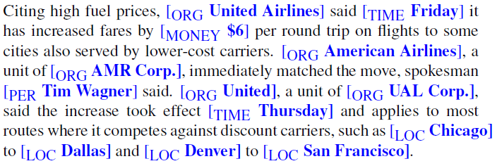

## 8.3 命名实体和命名实体标注（*Named Entities and Named Entity Tagging*）

词性标注可以告诉我们，像 *Janet*、*Stanford University* 和 *Colorado* 这样的词都是专有名词；专有名词是这些词的一个语法属性。但是从语义的角度来看，这些专有名词指的是不同种类的实体。*Janet* 是一个人，*Stanford University* 是一个组织，而 *Colorado* 是一个地点。

粗略地说，一个**命名实体**（*named entity*）是指任何可以用专有名词来指代的东西：一个人、一个地点、一个组织。**命名实体识别**（*named entity recognition*）（**NER**）任务是找到构成专有名词的文本跨度并标注实体的类型。最常见的四个实体标签是：**PER**（人），**LOC**（地点），**ORG**（组织），或 **GPE**（地缘政治实体（*geo-political entity*））。然而，**命名实体**这一术语通常被扩展到包括那些本身不是实体的东西，包括日期、时间和其他种类的时间表达，甚至包括像价格这样的数字表达。下面是一个 NER 标注器输出的例子：

